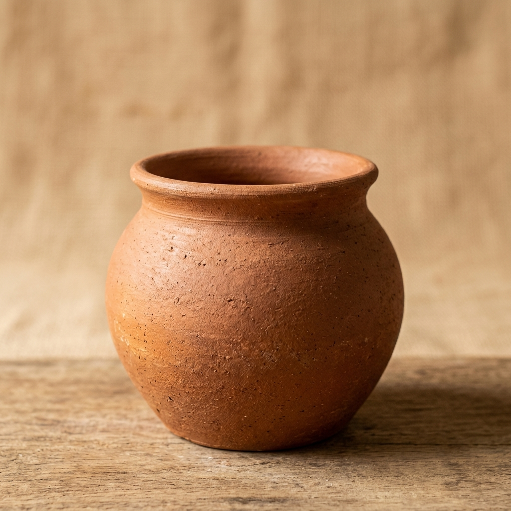
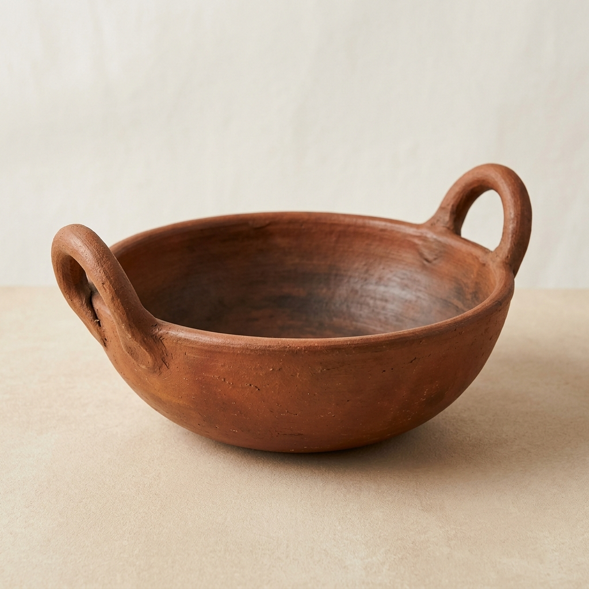

# Kumbara Kala

**Kumbara Kala** is an Android app that helps traditional Kumbara (pottery) artisans showcase clay products, share health and eco benefits, and create branded **story cards** they can save, edit, and share with customers.

**Repository:** [https://github.com/Ananyahkumar/Kumbara-Kala](https://github.com/Ananyahkumar/Kumbara-Kala)

---

## Problem statement

Many artisans lack a simple digital way to explain why their clay products matter—health benefits, sustainability, and their personal craft story. Kumbara Kala gives makers a mobile catalog, profile, and story-card builder so they can present products professionally without a complex e-commerce setup.

**Target users:** Kumbara artisans, craft sellers, and students exploring heritage product storytelling.

---

## Features

| Module | Description |
|--------|-------------|
| **Authentication** | Email/password sign-up and login with Firebase Auth; artisan profile stored in Firestore |
| **Product catalog** | Grid of traditional clay items (curd pot, diya, cooking pan) with health & eco benefit copy |
| **Story generator** | Build a shareable story card from catalog products or a custom photo + details |
| **Artisan bio** | View and manage maker profile (name, title, location, experience, specialization) |
| **Saved story gallery** | Save cards locally, open to edit, share as image, or delete |
| **Share** | Export story cards via Android share intent |

---

## Tech stack

- **Language:** Kotlin  
- **UI:** Jetpack Compose (Material 3) + Navigation Compose  
- **Backend:** Firebase Authentication, Cloud Firestore  
- **Images:** Coil, custom canvas/bitmap utilities  
- **Build:** Gradle (Kotlin DSL), Android Gradle Plugin 9.x  
- **Min SDK:** 24 | **Target / compile SDK:** 36  

---

## Screenshots

Product catalog assets and artisan imagery used in the app:

| Catalog | Story assets |
|---------|----------------|
|  |  |
|  |  |

> **Tip:** After running the app on an emulator or device, you can add full UI screenshots under `docs/screenshots/` and link them here.

---

## Project structure

```
KumbaraKala/
├── app/
│   ├── build.gradle.kts          # App dependencies & Android config
│   ├── google-services.json      # Firebase Android config (required to build)
│   └── src/main/
│       ├── java/com/example/kumbarakala/
│       │   ├── data/             # ProductData, ProfileRepository, StoryCardRepository
│       │   ├── model/            # Product model
│       │   ├── ui/
│       │   │   ├── auth/         # Login & registration
│       │   │   ├── screens/      # Catalog, story generator, gallery, bio
│       │   │   └── theme/        # Compose theme
│       │   └── utils/            # Bitmap, canvas, image, share helpers
│       └── res/                  # Drawables, layouts, strings, manifest resources
├── gradle/
│   └── libs.versions.toml        # Version catalog
├── build.gradle.kts
├── settings.gradle.kts
└── README.md
```

---

## Prerequisites

- [Android Studio](https://developer.android.com/studio) (Ladybug or newer recommended)
- **JDK 11+** (project uses Java 11 compatibility)
- **Android SDK** with API **36** installed
- A Firebase project with **Authentication (Email/Password)** and **Cloud Firestore** enabled

---

## Installation & setup

### 1. Clone the repository

```bash
git clone https://github.com/Ananyahkumar/Kumbara-Kala.git
cd Kumbara-Kala
```

### 2. Open in Android Studio

1. **File → Open** and select the project root folder.  
2. Let Gradle sync finish (Android Studio will download dependencies).

### 3. Firebase configuration

This project ships with `app/google-services.json` for the **Kumbara Kala** Firebase project so evaluators can build immediately.

To use your own Firebase project:

1. Create a project at [Firebase Console](https://console.firebase.google.com/).  
2. Add an **Android app** with package name `com.example.kumbarakala`.  
3. Download `google-services.json` and replace `app/google-services.json`.  
4. Enable **Email/Password** sign-in under Authentication.  
5. Create a Firestore database (test mode is fine for development).

### 4. Build from the command line (optional)

**Windows:**

```bash
gradlew.bat assembleDebug
```

**macOS / Linux:**

```bash
./gradlew assembleDebug
```

On success, the debug APK is at:

`app/build/outputs/apk/debug/app-debug.apk`

---

## Run the app

### Android Studio

1. Connect a device with USB debugging **or** start an Android emulator (API 24+).  
2. Select the **app** run configuration.  
3. Click **Run** (green play button).

### Command line

```bash
gradlew.bat installDebug
```

Then open **Kumbara Kala** on the device/emulator.

### First-time usage

1. **Sign up** with email, password, and artisan profile fields.  
2. Browse the **catalog** and tap a product to open the **story generator**.  
3. Use **Create Custom Story** for your own product photo.  
4. Save cards to **Saved Story Gallery** and share when ready.

---

## Testing

```bash
gradlew.bat test
gradlew.bat connectedAndroidTest
```

Unit tests live under `app/src/test/`; instrumented tests under `app/src/androidTest/`.

---

## Future improvements

- [ ] Rename application ID from `com.example.kumbarakala` to a production package name  
- [ ] Cloud sync for saved story cards  
- [ ] Multi-language support (Kannada / regional languages)  
- [ ] In-app screenshot-ready onboarding tour  
- [ ] Published Play Store demo link  

---

## Author

Developed as part of the **MindMatrix / Kumbara Kala** internship project.

## License

This project is submitted for academic evaluation. Contact the repository owner for reuse permissions.
